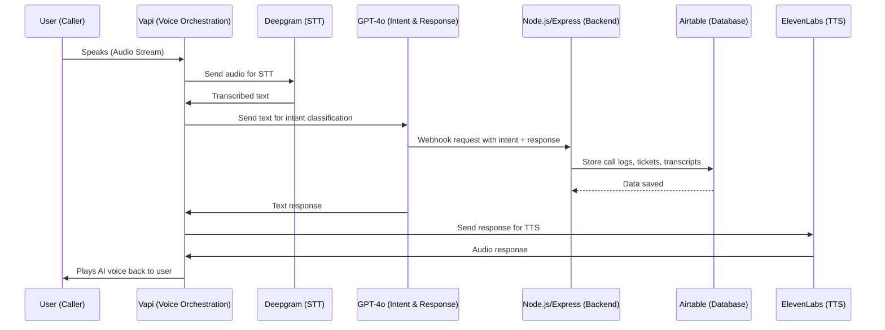

# AI Property Management Voice Line – Workflow

This document explains how each third-party tool fits into the **Voice AI system**.

---

## 🔄 Process Flow

### 1. User Speaks → Audio Capture
- **Tool:** **Vapi**  
- **Role:** Handles the call and streams audio back and forth between the user and the AI system.  
- **Output:** Raw audio stream (user’s voice).
"I want to report a broken AC in apartment 204."
---

### 2. Speech-to-Text (Transcription)
- **Tool:** **Deepgram (via Vapi)**  
- **Role:** Converts the user’s voice (audio) into text.  
- **Output:**  

---

### 3. Intent Understanding & Response Generation
- **Tool:** **OpenAI GPT-4o**  
- **Role:**  
- Classifies intent (e.g., *maintenance request*).  
- Generates natural language response.  
- **Output:**  

Got it, I’ll log a maintenance ticket for apartment 204.
Do you want me to send someone today or tomorrow?
---

### 4. Action / Data Handling
- **Tool:** **Node.js/Express backend**  
- **Role:**  
- Acts as the webhook server where GPT’s response or intent triggers business logic.  
- Creates/updates tickets in Airtable, logs the call, sends notifications.  
- **Output:** API call to **Airtable**.

---

### 5. Database & Records
- **Tool:** **Airtable**  
- **Role:**  
- Stores call transcripts, logs, and tickets.  
- Provides a dashboard for managing property issues and communication history.  
- **Output:** Persistent structured data.

---

### 6. Text-to-Speech (Reply back to User)
- **Tool:** **ElevenLabs (via Vapi)**  
- **Role:** Converts GPT-generated text into natural-sounding voice.  
- **Output:**  
"Thanks, I’ve logged your maintenance ticket.
A technician will be there tomorrow morning."

---

### 7. Send Voice Back to Caller
- **Tool:** **Vapi**  
- **Role:** Streams ElevenLabs audio back to the phone line.  
- **Output:** User hears the AI’s voice response.  

---

## 🧩 Summary in Steps
1. **User voice →** Vapi captures call  
2. **STT →** Deepgram transcribes speech  
3. **NLU/Response →** GPT-4o interprets + replies  
4. **Action →** Node.js/Express handles workflows, updates Airtable  
5. **Storage →** Airtable keeps call logs, tickets  
6. **TTS →** ElevenLabs voices GPT reply  
7. **Delivery →** Vapi sends AI’s voice to caller  

---

## ⚡ Tool Responsibilities
- **Vapi** → Orchestration (real-time voice handling)  
- **Deepgram** → Speech-to-Text  
- **GPT-4o** → Brain (intent + response)  
- **Node.js/Express** → Business logic + integrations  
- **Airtable** → Data hub  
- **ElevenLabs** → Voice personality  

---

## 📊 System Diagram (Mermaid.js)

